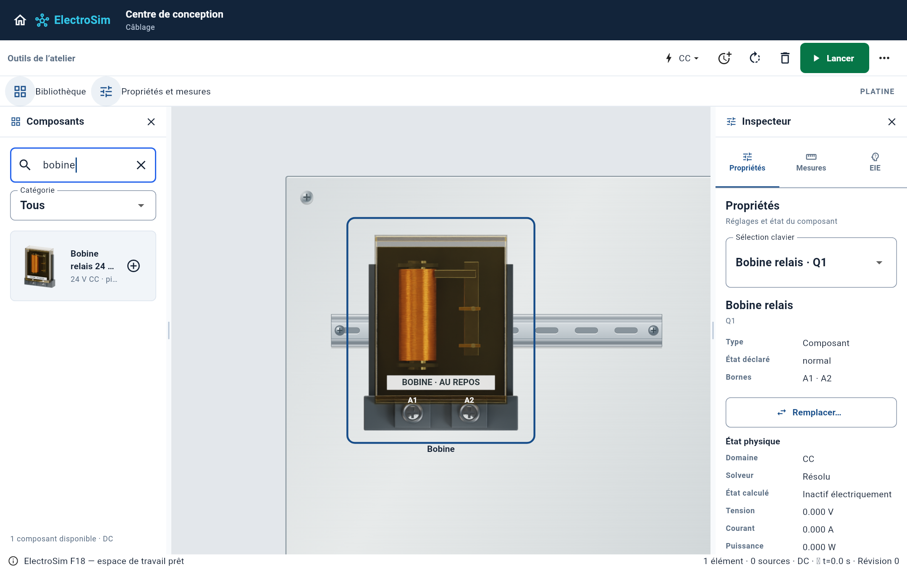
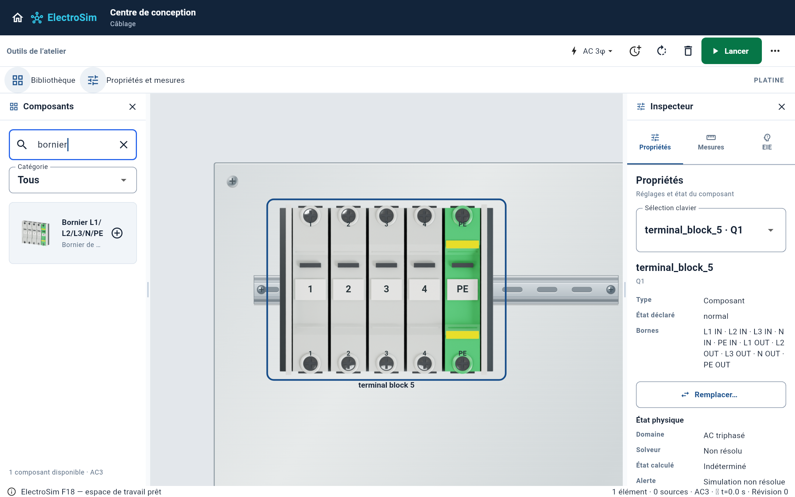
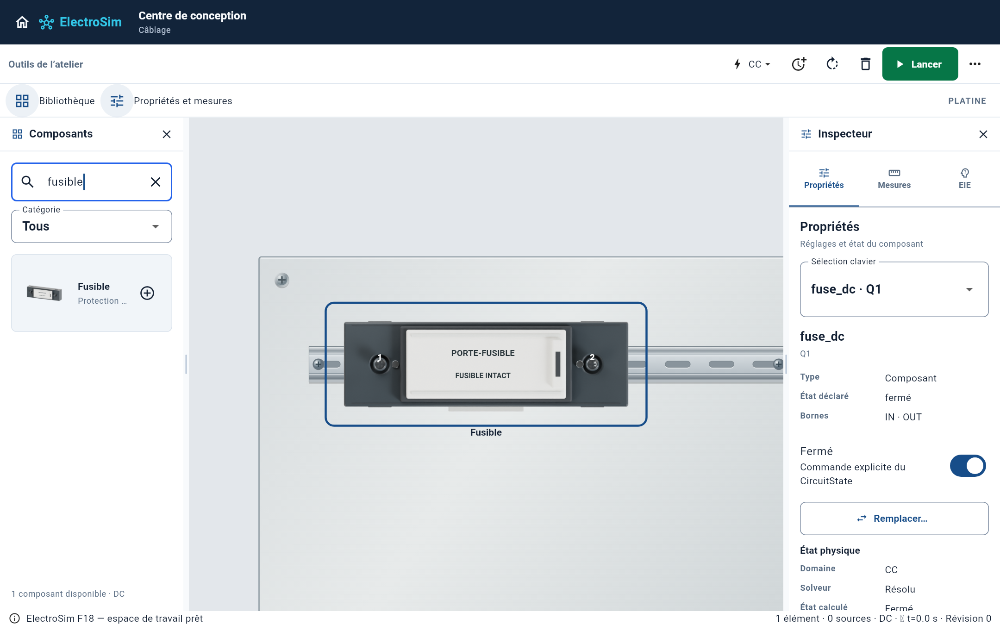
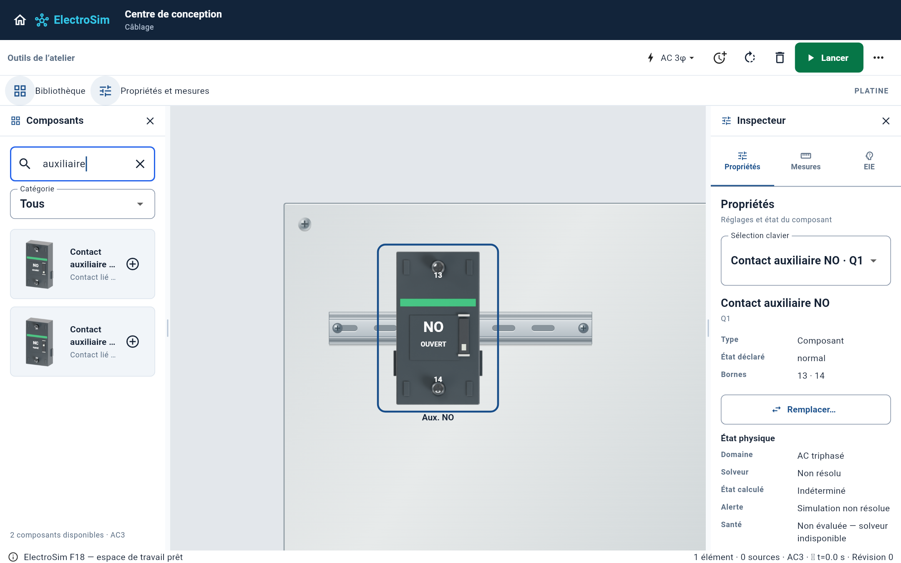

# Extension des composants industriels — vues palette et platine

Cette branche prolonge la platine métallisée, sans fusionner ni la branche de
platine ni cette extension. Les modifications du moteur électrique, de la
persistance, des rails DIN et du routage ne font pas partie de ce lot.

## Modèles ajoutés

| Géométrie originale | Types ElectroSim | Construction retenue |
|---|---|---|
| Porte-fusible | `fuse_dc`, `fuse_ac1`, `fuse` | Corps graphite, carrier ivoire, charnières, prise de tiroir et deux vis encastrées |
| Bloc auxiliaire NO | `contactor_aux_no`, `relay_contact_no` | Boîtier clipsable, guides arrière, deux vis et indicateur mécanique |
| Bloc auxiliaire NC | `contactor_aux_nc`, `relay_contact_nc` | Même construction, état de contact inversé au repos |
| Bobine de relais | `relay_coil` | Enroulement hélicoïdal en cuivre, circuit magnétique, capot creux transparent et socle à deux bornes A1/A2 |
| Bornier cinq voies | `terminal_block_5` | Cinq moulages isolants distincts, dix vis, marqueurs individuels, end plates et cinquième voie PE vert/jaune |

Les images sont rendues à partir de géométries originales dans Cycles ; les
photos commerciales restent des références de construction hors du dépôt.
La palette utilise une caméra en perspective et la platine une caméra frontale.
Les images immuables sont partagées entre les instances ; Flutter peint les
indications électriques à partir des états existants. Aucun rendu 3D en temps
réel n'est ajouté au calcul du circuit. Les 68 textures industrielles représentent
31,65 Mio de pixels RGBA décodés, partagés entre les instances ; cette mesure
n'inclut pas les autres ressources ni les allocations GPU de Flutter.

## Références comparées

- [Porte-fusible DF101](https://mm.digikey.com/Volume0/opasdata/d220001/medias/images/5753/MFG_DF101.jpg) : porteur blanc dans une carcasse sombre. L'orientation **horizontale** et l'enveloppe de 300 × 110 unités du composant existant sont conservées ; ce n'est pas une reproduction dimensionnelle du DF101 vertical.
- [Bloc LADN11](https://cdn.eleczo.com/media/catalog/product/s/c/schneider-auxiliary-contact-block-ladn11.webp?height=265&image-type=image&store=default&width=265) : moulage, guides et vis. ElectroSim expose un contact séparé à deux bornes, contrairement au bloc combiné photographié.
- [Relais Finder 40.52](https://www.autoportee-discount.fr/597452-large_default/relais-finder-405280240000.jpg) : construction transparente et bobine visible. La tension AC et les huit broches du produit photographié ne sont pas recopiées sur la bobine CC à deux bornes simulée. Les contacts de relais restent des composants séparés liés au moteur existant.
- [Phoenix UK5N](https://www.lagerwerk.com/media/image/9e/80/96/DSC_3338.jpg) : profil moulé et fixation DIN. L'ensemble cinq voies représente cinq passages indépendants ; aucun pont électrique commun n'est introduit.

## Protection des fonctionnalités

Les dimensions de connexion, indices et coordonnées des bornes restent celles
du contrat Canvas. Le test de géométrie vérifie également tous les alias et
contrôle dans les images frontales que chaque point de raccordement se situe
sur l'empreinte de sa vis. Les contacts utilisent `actuated` (NO ouvert au repos,
NC fermé au repos), conformément au rendu natif. Les états de fusible et de
bobine restent fournis par l'application, sans modèle électrique nouveau.

Les captures dans `proof/` proviennent des widgets de production de la palette
et de la platine, via `tool/capture_g5_industrial_test.dart`. Elles montrent le
rendu Flutter ; elles ne constituent pas une qualification électrique fabricant
ni une mesure des performances à 400 composants.

## Reproduire

1. Depuis `apps/electrosim`, lancer `flutter test --no-pub test/g5_industrial_physical_assets_test.dart` ; ce test exporte les coordonnées dans `build/g5-industrial-geometry.json`.
2. Le manifeste d'actifs doit correspondre à cet export ; seuls les cinq nouveaux modèles sont rendus avec `ELECTROSIM_INDUSTRIAL_MODELS=fuse-holder,auxiliary-no,auxiliary-nc,coil,terminal5 blender -b --factory-startup -t 4 --python tools/render_g5_industrial.py` depuis la racine.
3. Depuis l'application, lancer les tests de rendu et `flutter test --no-pub tool/capture_g5_industrial_test.dart`.

Ce lot étend les familles industrielles prioritaires ; les autres appareils du
catalogue conservent leurs rendus existants. Il ne prétend pas terminer les 74
apparences ni garantir une identité photographique à 100 %.

## Vérifications effectuées

- Application : **420 tests réussis** (`flutter test --no-pub --concurrency=1`).
- Géométrie et états des composants : **7 tests ciblés réussis**.
- Captures des widgets de production : **4 tests réussis** ; les nouveaux composants figurent simultanément dans la palette et sur la platine avec un rail DIN.
- Analyse Dart de l'application : aucun problème.
- Gardes d'architecture et contrat P1 : réussis.
- Produit Web release (`lib/main.dart`) : compilation réussie. La compilation Mac reste celle du workflow GitHub ; son résultat ne se déduit pas de la compilation Web locale.

