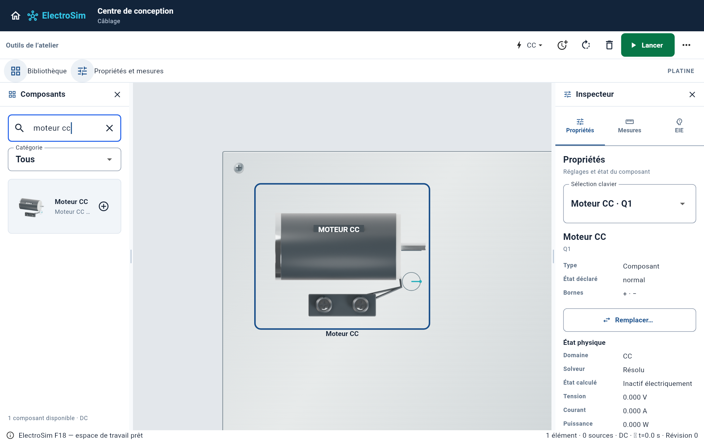
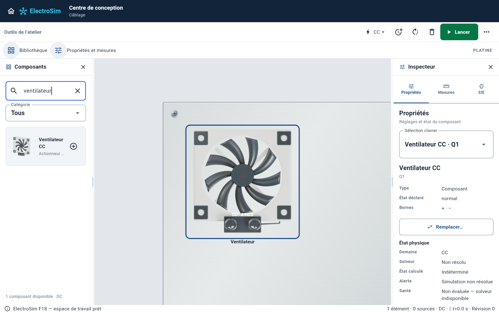
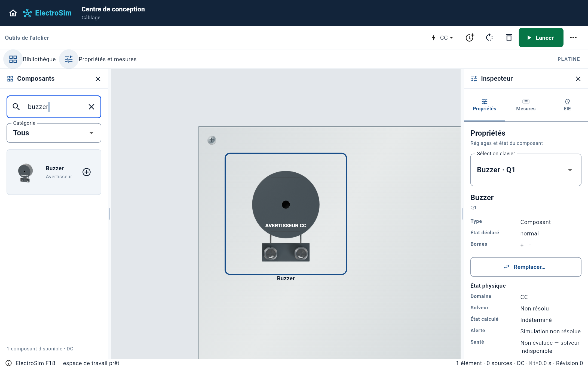
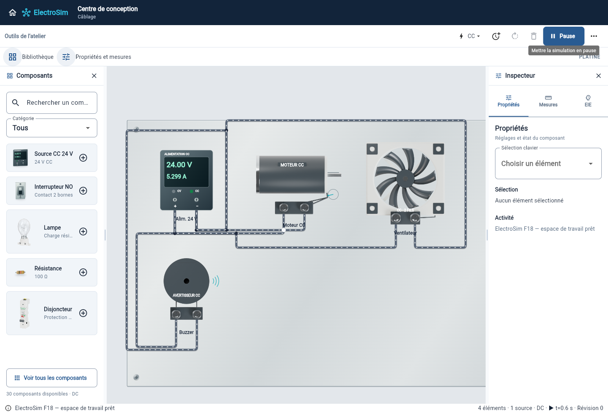
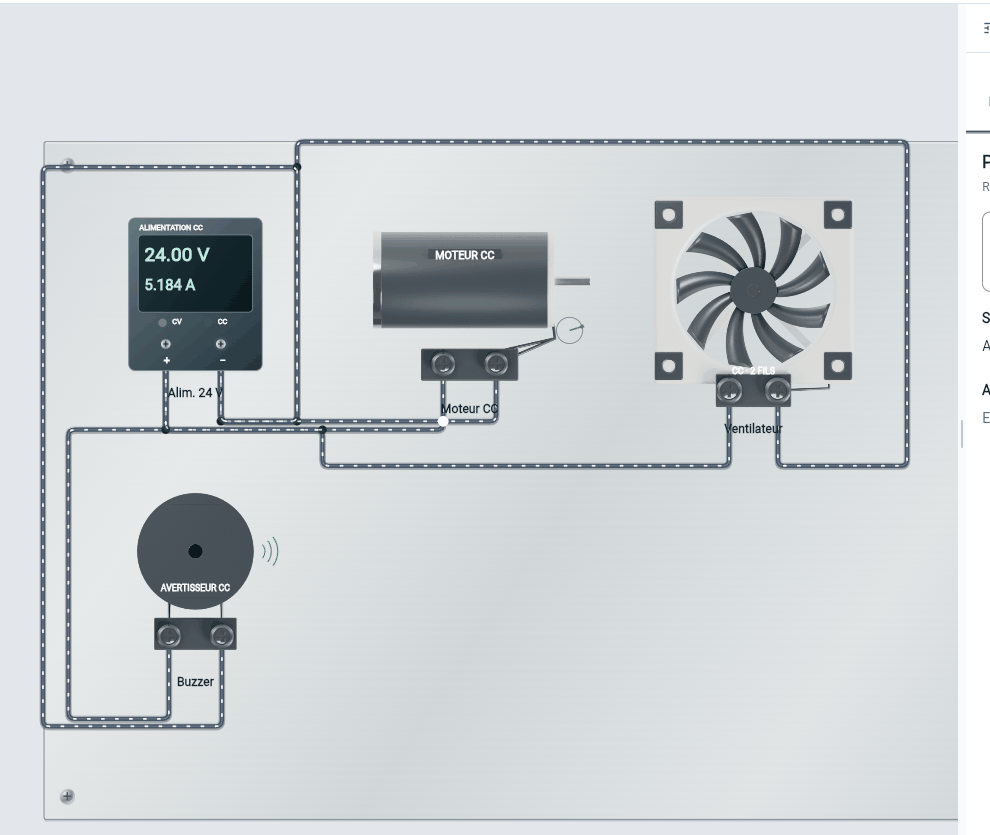

# Récepteurs : géométries, sons et rotations

Cette continuation de la PR 72 conserve la platine métallisée, les rails et les
coordonnées des raccordements. La branche reste séparée, sans fusion.

## Comparaison aux appareils réels

Trois géométries originales ont été construites et rendues dans Blender/Cycles,
avec perspective dans la palette et vue frontale sur la platine :

- Moteur CC : corps cylindrique, flasques métalliques, arbre et sortie des fils.
  Référence : [maxon RE40](https://www.maxongroup.in/medias/sys_master/root/8845741096990/RE-40-148866-NEW.jpg).
- Ventilateur : cadre carré, quatre fixations, supports arrière et neuf pales
  courbes séparées du boîtier. Référence : [ventilateur Noctua](https://media.ldlc.com/r1600/ld/products/00/04/94/42/LD0004944243_2.jpg).
- Buzzer : enveloppe cylindrique, cavité acoustique et deux conducteurs.
  Référence : [Soberton WT-1209PT](https://www.marutsu.co.jp/contents/shop/marutsu/dgimg/goods/Photos/SobertonPhotos/WT-1209PT.jpg).

Les photos restent des références externes. Les petits adaptateurs à vis
représentent les raccordements pédagogiques existants : les photos du moteur
et du buzzer présentent des fils ou broches. Le ventilateur simulé reste un
appareil CC à deux fils ; la référence photographique PWM n'ajoute aucun port
ni fonction PWM. Les matériaux et dimensions ne constituent pas des modèles
fabricant certifiés. Les autres composants du catalogue gardent leurs rendus.

## Animation et audio

Le moteur CC suit l'état de vitesse angulaire du moteur de simulation, avec
sens inverse et maintien de l'angle lors d'un changement de vitesse. Son
repère visuel effectue des tours complets ; le corps et les bornes restent fixes.
Les vitesses élevées sont comprimées pour éviter une animation illisible au
rafraîchissement de l'écran : l'animation n'est pas un tachymètre.

Le moteur triphasé indique le sens d'ordre des phases et la fréquence du champ
synchrone. Le solveur AC3 actuel calcule les impédances des enroulements,
sans glissement ni inertie mécanique de l'arbre. Le ventilateur dispose d'une
animation qualitative dépendant de la tension, car son modèle est résistif.
Ces indications ne sont donc pas des vitesses mécaniques mesurées.

Le buzzer alimenté émet un son synthétisé en boucle. Deux voix audio partagées,
buzzer et avertisseur, limitent le nombre de lecteurs à deux indépendamment
du nombre de composants. Le profil `soundProfile: 'horn'` sélectionne le son
d'avertisseur sur un composant compatible ; aucun nouveau claxon électrique
n'est ajouté au catalogue. La pause, la désalimentation, la suppression du
composant et le bouton « Couper les sons des composants » arrêtent le son.
Les appels audio sont sérialisés et ne s'exécutent pas à chaque image.

Le variateur n'est pas présent dans cette branche. Son raccordement attend
l'identification de la branche qui contient son modèle ; aucune variation de
fréquence fictive n'est ajoutée au solveur.

## Vérification

- Application : 425 tests réussis, analyse Dart sans problème.
- Captures des widgets de production : quatre tests réussis.
- Contrats d'architecture et P1 : réussis ; aucun changement du solveur ni des ports.
- Compilation Web release réussie avec l'entrée de preuve
  `lib/industrial_audio_motion_proof_main.dart`, utilisant le vrai workspace.
- Les tests vérifient notamment les images identiques après un tour complet,
  le sens du moteur CC calculé, les raccordements et l'arrêt audio sérialisé.
- Navigateur Chromium : lecture réelle du WAV après clic sur « Lancer », puis
  arrêt par le menu de sons et pause. Les événements média `kPlay` et `kPause`
  sont enregistrés dans `proof/playback-evidence.json`, sans erreur de page.
  Onze des douze images capturées diffèrent pendant le fonctionnement.
  Le GIF est un recadrage de ces images du produit, sans modification du rendu.

Les captures ci-dessous proviennent de Flutter, sans retouche. Les performances
avec 400 composants et la compilation native Mac ne sont pas déduites de ces
vérifications.

Pour reproduire les captures : depuis `apps/electrosim`, lancer
`flutter test --no-pub tool/capture_g5_industrial_test.dart`.
Pour reproduire la vérification navigateur : compiler l'entrée de preuve puis
lancer `tools/capture_industrial_audio_motion.py --web-root <build/web> --output <dossier>`.
