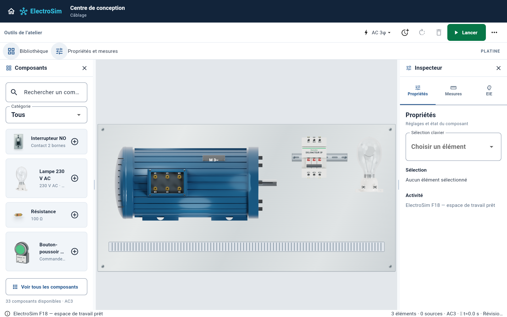
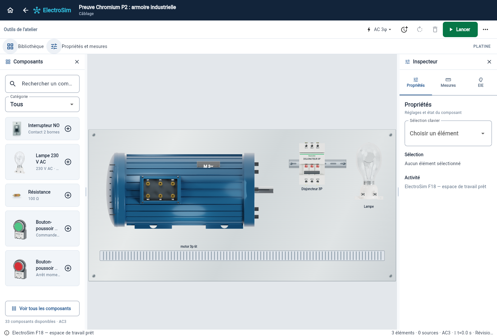

# Platine métallisée

Le fond de la vue physique utilise une tôle gris argent satiné, avec grain horizontal discret, reflets doux, contour fin et petites fixations métalliques. La surface reste en coordonnées monde pendant le pan et le zoom. Son enveloppe s’adapte à l’implantation des composants et des fixtures, avec une marge de 48 unités. Les projets vides disposent d’une surface de départ.

Cette modification concerne uniquement le fond peint de la platine : aucun déplacement, changement de borne, contrainte de placement, sauvegarde ou calcul électrique n’est introduit. Les rails DIN et goulottes existants sont conservés au-dessus de la tôle. Les masques des croisements de fils utilisent le même dégradé métallique pour éviter des pastilles blanches. Le mode Canvas historique avec chrome conserve son quadrillage ; aucune bascule Platine / Schéma n’est ajoutée.

Le grain est déterministe et limité à 192 traits ; il disparaît aux petits niveaux de zoom. Les dix références visuelles F9 sont mises à jour pour le nouveau fond sans changer les tolérances.

La capture utilise les widgets de production, avec un exemple de moteur, de protection, de lampe, de rail DIN et de goulotte.

Une seconde preuve provient du produit Web release compilé, capturé sous Chromium sans erreur JavaScript :

