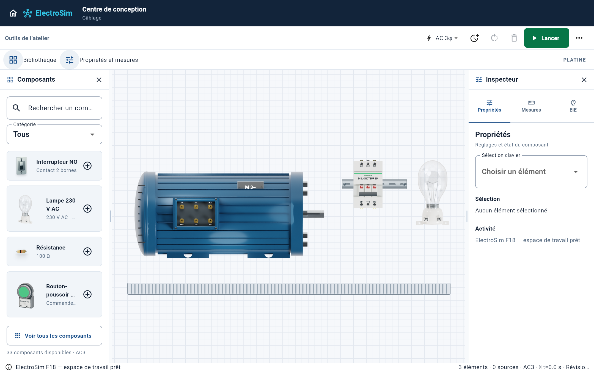

# Candidat intégré G5 / P2

## Sources réunies

- G5 : `a8e2025dd9c2339681e773671ea7b19dfbfc474f` (PR 59).
- Implantation P2 : `94fe17ed69f07c750d4f50565252603cc6832b5b` (PR 60).

Le candidat conserve les rendus industriels originaux, le moteur à bornier latéral, la lampe A60 / E27 et leurs dimensions physiques. Il ajoute les rails DIN, goulottes et zones de borniers éditables, le placement assisté, la détection des collisions, le routage explicite par goulotte et la sauvegarde version 2 compatible version 1.

## Corrections propres à l’intégration

La migration des anciens gabarits, le déplacement d’un appareil câblé et le tracé provisoire au clic de connexion conservent désormais les rails et goulottes. Le routeur F9 historique conserve également l’implantation et les rotations. Quatre tests ciblés couvrent ces opérations. Aucun solveur ou contrat électrique n’est modifié.

## Vérification locale

Flutter 3.38.10 / Dart 3.10.9 : 419 tests de l’application, 98 tests Canvas, 4 tests de capture, analyse Dart sans erreur et gardes d’architecture / P1 réussies. La capture ci-dessous provient des widgets de production Flutter, avec un circuit d’exemple non alimenté. Elle ne constitue pas une validation physique de l’application sur Mac. Les workflows GitHub qualifient séparément la compilation Web, Chromium et le candidat macOS Intel avec le SHA source exact.

## Limites explicites

Le fond quadrillé reste présent. La platine métallique galvanisée validée et la véritable bascule Platine / Schéma ne font pas partie de cette intégration. Les zones de borniers sont des zones physiques, pas de nouveaux borniers électriques. Le routage par goulotte est une commande explicite, sans calcul de taux de remplissage. Les projets anciens très denses peuvent nécessiter de réespacer les appareils après migration des dimensions. Une validation physique Mac reste nécessaire.
