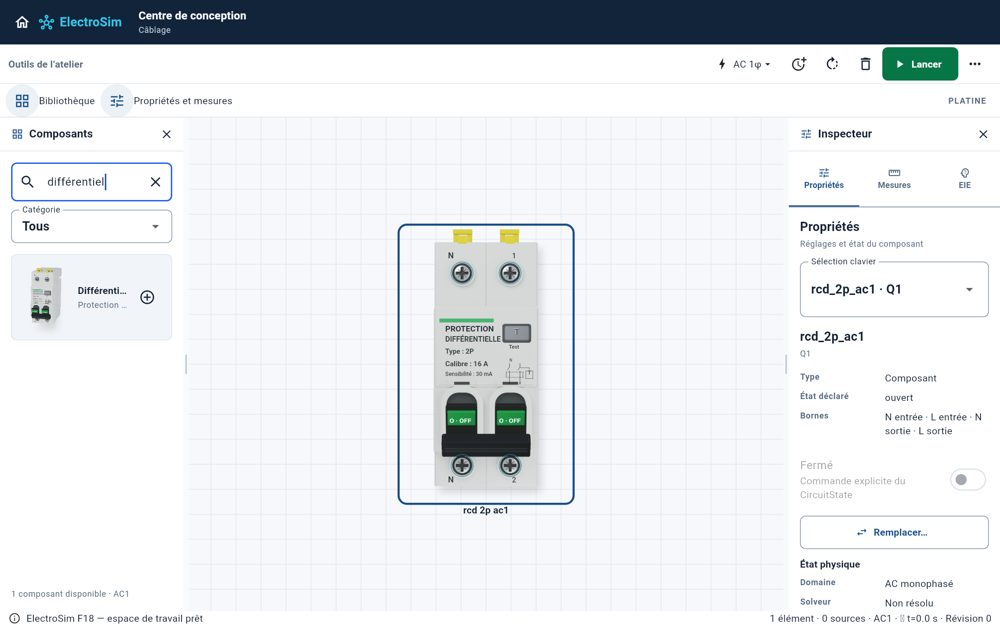
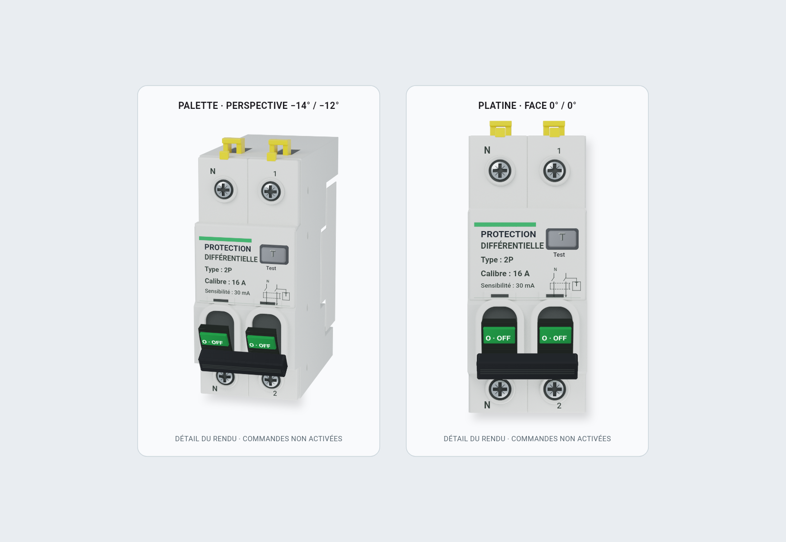
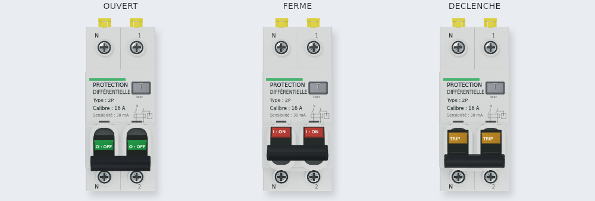

# ElectroSim G5 — rendu du différentiel 2P

Base : `feat/g5-industrial-geometry-20261009`, commit `150f0bd56d9671eea97a48bbfff8bf6ec168752f`.
Branche de travail : `feat/g5-reference-rendering-20261009`.

Le différentiel utilise un boîtier calculé en 3D avec matériaux physiques, en perspective dans la palette et de face sur la platine. Les vis PZ, les cavités, les chanfreins, le relief latéral et les clips jaunes viennent d'un modèle Blender/Cycles construit pour ce composant. La photo de référence n'est pas incluse dans les textures. Les marquages variables, le bouton Test, les leviers et la barre de commande restent pilotés par Dart.

## Captures réelles







Les captures proviennent de widgets Flutter effectivement exécutés. La platine de la première capture contient seulement Q1 ; le solveur affiché « Non résolu » ne prétend donc pas démontrer un circuit alimenté. Les états électriques et Test sont vérifiés séparément.

## Intégration

Pour une branche dérivée de cette base, appliquer le patch fourni après `git apply --check`. Si la branche a d'autres modifications, intégrer les différences ; ne pas remplacer globalement `main.dart` ou `pubspec.yaml`.

Le module requiert **les deux fichiers** :

- `apps/electrosim/lib/reference_components/disjoncteur_3d.dart`
- `apps/electrosim/lib/reference_components/rcd2p_industrial_geometry.dart` (fichier `part`)

Copier aussi les deux PNG dans `apps/electrosim/assets/g5_physical/` et ajouter ces lignes dans la section `flutter.assets` existante :

```yaml
flutter:
  assets:
    - assets/g5_physical/housing-palette.png
    - assets/g5_physical/housing-platine.png
```

Conserver les autres assets, dépendances et réglages présents. Exécuter `flutter pub get` après modification du manifeste.

L'API publique, l'ordre N/L/N/L des quatre bornes, les coordonnées du projecteur et les zones de clic sont conservés. Utiliser `vue: VueDisjoncteur.palette` dans la palette et `vue: VueDisjoncteur.platine` sur la platine. Les états restent fournis par le moteur via `etat`, et les événements passent par `onCommande`, `onTest` et `onBorne`.

Précharger les deux textures pendant l'ouverture de l'application, après initialisation de Flutter, évite d'afficher brièvement le rendu natif :

```dart
WidgetsFlutterBinding.ensureInitialized();
await Disjoncteur3D.prechargerTextures();
```

La modification fournie de `main()` lance ce chargement pendant la création du contrôleur de persistance. Le modèle natif Dart reste utilisable si les assets manquent ou ne se décodent pas.

## Coût et limites

Les deux images sont décodées une seule fois et partagées entre instances : environ 8,27 Mio RGBA, hors copies GPU. Les logements, inscriptions et ombres sont enregistrés dans un cache borné de 24 pictures. Les commandes mobiles sont redessinées pendant l'animation de 170 ms. Blender est utilisé pour produire les textures ; il n'est pas exécuté par ElectroSim et aucune nouvelle dépendance d'exécution n'est ajoutée.

Le résultat est un rendu de produit détaillé, pas une identité photographique certifiée à 100 %. L'éclairage, certaines proportions moulées et le fini des commandes restent différents de la photo fournie. Aucun débit de 400 composants ou résultat sur appareil mobile n'est revendiqué par ces vérifications.

## Vérifications exécutées

- Suite application : 364 tests réussis.
- Test ajouté après cette suite : 1 test de fallback réussi (365 tests validés au total).
- Dix tests ciblés : captures, vis sous les quatre ancres dans trois tailles/deux orientations, fermeture du flanc, intégration Canvas et Test alimenté/non alimenté.
- Analyse statique des sources modifiées et nouveaux tests : aucune anomalie.
- Trois références visuelles du différentiel actualisées volontairement ; toutes les autres conservées.
- Revue indépendante : aucun défaut majeur détecté dans les sources ou captures.

La base contenait un test d'identité de palette qui attendait l'ancien wrapper pour le différentiel. Il a été corrigé pour contrôler le renderer natif G5 déjà présent dans la base ; la route de production n'a pas été modifiée pour satisfaire ce test.

```bash
cd apps/electrosim
flutter test --concurrency=1
flutter test tool/capture_g5_reference_test.dart
```

Les captures sont écrites par défaut dans `build/g5-reference-proof`. `ELECTROSIM_G5_PROOF_DIR` modifie ce dossier ; `FLUTTER_ROOT` peut désigner le SDK pour les polices de capture.

Pour régénérer les deux textures à partir du modèle source :

```bash
blender -b --factory-startup -t 4 --python tools/render_g5_physical.py
```

La version Blender utilisée ici ne fournit pas OpenImageDenoise ; le générateur utilise donc 64 échantillons sans débruitage externe. Les PNG sont des sorties directes du calcul 3D.
